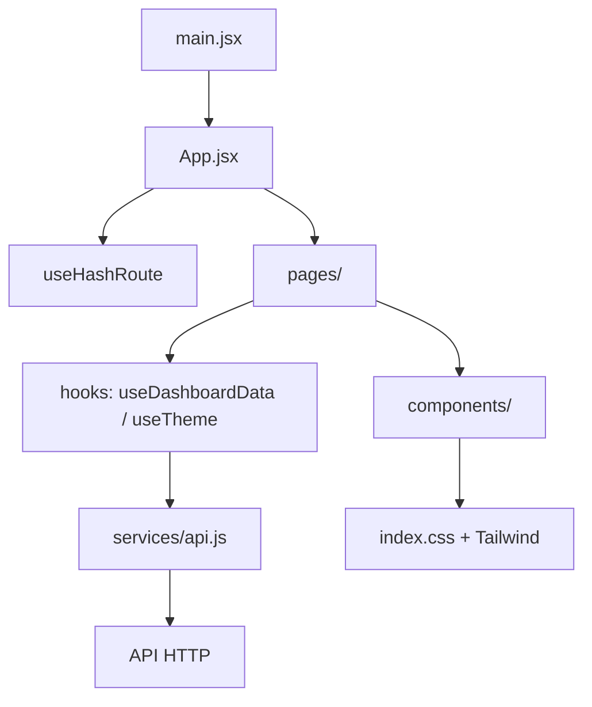

# Arquitetura do frontend

## Visão geral



| Camada | Local | Responsabilidade |
| --- | --- | --- |
| Entrada | `src/main.jsx` | Monta `App` em `StrictMode`. |
| Roteamento | `src/hooks/useHashRoute.js` | Resolve rotas por hash e aplica fallback seguro para `painel`. |
| Composição | `src/App.jsx` | Seleciona a página e aplica Sidebar/layout nas áreas autenticadas futuramente. |
| Páginas | `src/pages/` | Painel, autenticação, colaboradores, tasks, relatórios e configurações. |
| Componentes | `src/components/` | Elementos visuais reutilizáveis e componentes do dashboard. |
| Estado/efeitos | `src/hooks/` | Dados do dashboard, tema e navegação. |
| HTTP | `src/services/api.js` | Centraliza os contratos atualmente consumidos. |
| Utilitários | `src/utils/` | Formatação e funções auxiliares. |
| Navegação | `src/data/dashboardData.js` | Itens da Sidebar previstos no sitemap. |

## Navegação

O frontend utiliza hash routing sem dependência externa de roteador. Rotas reconhecidas:

```text
#/painel
#/colaboradores
#/tasks
#/relatorios
#/configuracoes
#/login
#/cadastro
```

Rotas desconhecidas retornam para `painel`. Login e cadastro são renderizados fora do shell com Sidebar. As demais telas usam o layout principal.

## Dashboard

`DashboardPage.jsx` mantém o comportamento atualmente suportado por `useDashboardData`: data de referência, filtro de colaborador, auto-refresh, retry, status da API e indicadores que podem ser calculados com segurança.

Indicadores exigidos por RF-27 que ainda não existem no contrato permanecem explicitamente indisponíveis; não são inferidos nem preenchidos com mocks.

## Formulários administrativos

`AuthPage`, `TasksPage`, `SettingsPage`, `CollaboratorsPage` e `ReportsPage` implementam apenas responsabilidade frontend: layout, labels, validação local, feedback e estados. Ações que exigem persistência permanecem bloqueadas até contrato oficial.

## Segurança de frontend

- Credenciais não são persistidas pelo frontend atual.
- Não existe token fictício ou sessão simulada.
- Permissões definitivas devem ser validadas no backend.
- Em produção, a API deve ser acessada por HTTPS.
- Dados não necessários ao Dashboard, como `window_title`, não são exibidos na visão gerencial.

## Testes

Vitest + React Testing Library cobrem componentes, hooks, serviços, utilitários e novas páginas. Consulte `TESTES.md`.
