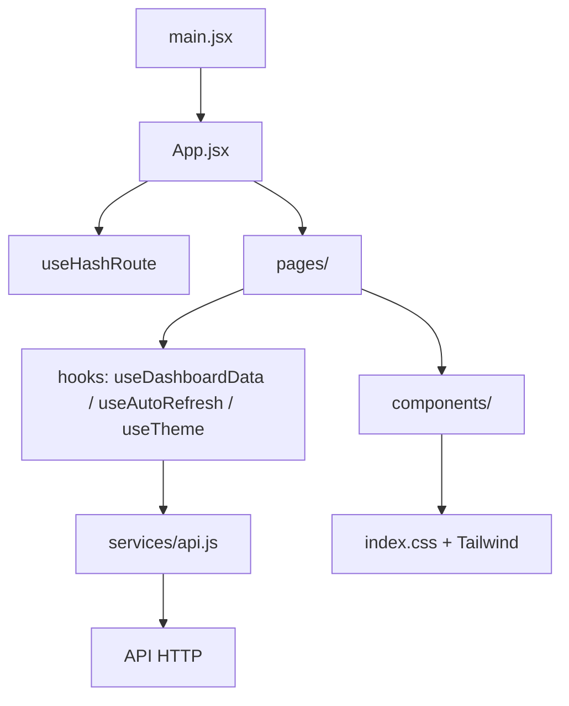

# Arquitetura do frontend

## Visão geral

| Camada | Local | Responsabilidade |
| --- | --- | --- |
| Entrada | `src/main.jsx` | Monta `App` em `StrictMode`. |
| Roteamento | `src/hooks/useHashRoute.js` | Resolve rotas por hash e fallback para `painel`. |
| Composição | `src/App.jsx` | Seleciona a página e aplica Sidebar/layout. |
| Páginas | `src/pages/` | Painel e telas administrativas. |
| Componentes | `src/components/` | Elementos visuais reutilizáveis. |
| Estado/efeitos | `src/hooks/` | Ciclo de dados, auto-refresh/visibilidade e tema. |
| HTTP | `src/services/api.js` | Centraliza os contratos consumidos e a degradação de chamadas opcionais. |
| Utilitários | `src/utils/` | Formatação e transformações puras. |
| Navegação | `src/data/dashboardData.js` | Itens da Sidebar. |

## Dashboard

`useDashboardData` mantém o ciclo de rede e reutiliza somente os seis resumos históricos já carregados com sucesso no polling quando o filtro permanece igual. A atualização manual revalida também o histórico, pois o agente pode enviar registros atrasados. `useAutoRefresh` continua responsável apenas pelo intervalo/Visibility API. O resumo do dia selecionado, realtime e usuários permanecem atualizados em cada refresh.

O serviço diferencia falha principal de falhas opcionais. Se o resumo principal falhar, o hook entra em erro. Se realtime, usuários ou parte do histórico falharem, os dados válidos permanecem visíveis e o frontend marca a API como parcialmente disponível.

## Segurança e dados

Credenciais não são persistidas; não existe sessão simulada. Dados não necessários ao painel, como `window_title`, continuam fora da interface gerencial. Autorização definitiva, HTTPS e contratos de sessão pertencem ao backend/deploy.
