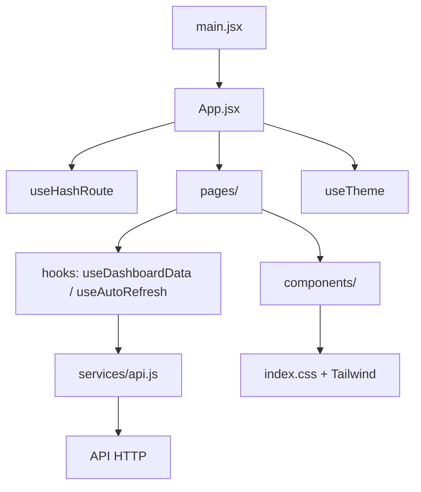

# Arquitetura do frontend

## Visão geral

| Camada | Local | Responsabilidade |
| --- | --- | --- |
| Entrada | `src/main.jsx` | Monta `App` em `StrictMode`. |
| Roteamento | `src/hooks/useHashRoute.js` | Resolve rotas por hash e fallback para `painel`. |
| Composição | `src/App.jsx` | Seleciona a página e aplica Sidebar/layout. |
| Páginas | `src/pages/` | Painel e telas administrativas. |
| Componentes | `src/components/` | Elementos visuais reutilizáveis. |
| Estado/efeitos | `src/hooks/` | Ciclo de dados, auto-refresh/visibilidade e tema. |
| HTTP | `src/services/api.js` | Centraliza os contratos consumidos e a degradação de chamadas opcionais. |
| Utilitários | `src/utils/` | Formatação e transformações puras. |
| Navegação | `src/data/dashboardData.js` | Itens da Sidebar. |

## Dashboard

`useDashboardData` mantém o ciclo de rede e reutiliza somente os seis resumos históricos já carregados com sucesso no polling quando o filtro permanece igual. A atualização manual revalida também o histórico, pois o agente pode enviar registros atrasados. `useAutoRefresh` continua responsável apenas pelo intervalo/Visibility API. O resumo do dia selecionado, realtime e usuários permanecem atualizados em cada refresh.

O serviço diferencia falha principal de falhas opcionais. Se o resumo principal falhar, o hook entra em erro. Se realtime, usuários ou parte do histórico falharem, os dados válidos permanecem visíveis e o frontend marca a API como parcialmente disponível.

O ciclo HTTP pertence ao serviço: um controller coordena o lote, e cada consulta
tem seu próprio timeout. Encerrar o lote cancela requisições remanescentes.
Consulte [DATA-FLOW.md](DATA-FLOW.md) para transições e cache.

## Impacto de manutenção

| Arquivo | Utilizado por / dependências | Motivo de existir e impacto de alteração |
| --- | --- | --- |
| `src/App.jsx` | `main.jsx`; páginas, Sidebar, `useHashRoute`, `useTheme` | Entrada comum de layout, rotas e tema; afeta todas as telas |
| `src/pages/DashboardPage.jsx` | App; componentes, `useDashboardData`, utils | Compõe dados, filtros e estados; concentra a integração visual do painel |
| `src/services/api.js` | `useDashboardData`; fetch, `safeIsoDate` | Único cliente HTTP ativo; alterações afetam filtros, série histórica e status |
| `src/hooks/useDashboardData.js` | DashboardPage; serviço e `useAutoRefresh` | Coordena estado e cache por filtro; afeta refresh e proteção contra respostas antigas |
| `src/hooks/useAutoRefresh.js` | `useDashboardData`; Visibility API | Isola intervalo e listeners do ciclo de dados |
| `src/hooks/useTheme.js` | App; localStorage, matchMedia, dataset | Mantém uma preferência global sem store ou context adicional |
| `src/hooks/useHashRoute.js` | App; hashchange | Resolve sete rotas e fallback; exige sincronização com navegação |
| `src/data/dashboardData.js` | Sidebar | Define apenas itens de menu, sem dados operacionais fictícios |
| `src/utils/dashboard.js` | Serviço, DashboardPage, Header, ActivityChart, PeopleCard, TimelineCard | Datas, filtros e duração compartilhados; alteração pode afetar rede e apresentação |
| `src/constants/ui.js` | Header, PeopleCard | Rótulos de estados e paleta de avatares |
| `src/index.css`, `tailwind.config.js` | Todas as telas via main/Vite | Estilos globais e tokens; impacto visual transversal |
| `vite.config.js`, `vitest.config.js` | Scripts npm | Entradas de build e testes independentes; não executam o legado |

Não há context, Redux, React Router, TypeScript ou carregamento de páginas por
convenção. Imports são estáticos; barrels são usados pelo painel. O protótipo
Blazor foi removido; permanece disponível somente no histórico do Git.

## Backend e persistência

Routers FastAPI usam `Depends(get_db)` para abrir/fechar sessões SQLAlchemy.
`crud.py` consulta `User`, `ActivityLog` e `Category`; regras de categorização e
`SystemSettings` também existem, mas não são consumidas pelo frontend ativo.
UUIDs relacionam usuários, logs, categorias e regras. `main.py` usa `create_all`,
sem migrations versionadas encontradas. Compose define PostgreSQL, API e seed;
o frontend não participa desse Compose. Não foi encontrada configuração CI/CD.

## Segurança e dados

Credenciais não são persistidas; não existe sessão simulada. Dados não necessários ao painel, como `window_title`, continuam fora da interface gerencial. Autorização definitiva, HTTPS e contratos de sessão pertencem ao backend/deploy.
