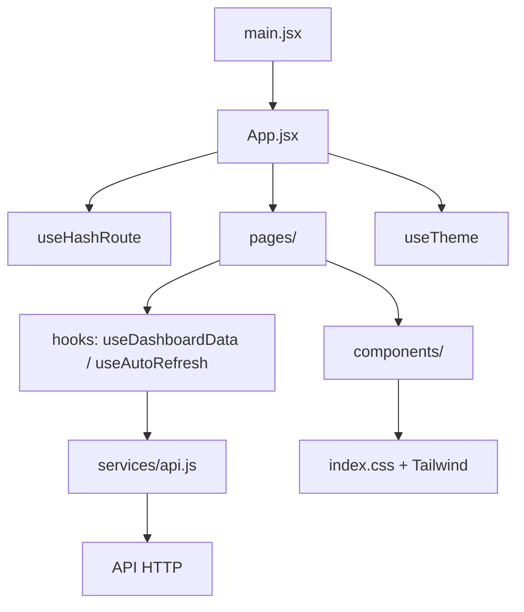
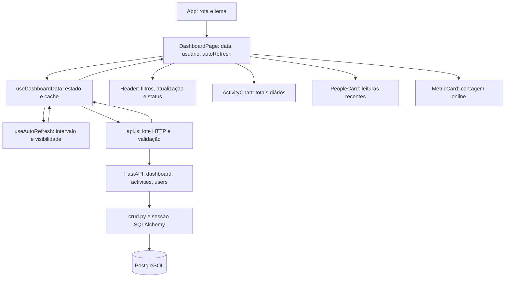

# Arquitetura e manutenção do frontend

[Voltar ao README](../README.md). Caminhos de código relativos a `FrontEnd/`.

- [Estrutura e responsabilidades](#estrutura-e-responsabilidades)
- [Fluxo de dados](#fluxo-de-dados)
- [Hooks](#hooks)
- [Componentes e páginas](#componentes-e-paginas)
- [Estilos, acessibilidade e responsividade](#interface)
- [Convenções e contribuição](#contribuicao)

## Estrutura e responsabilidades

### Visão geral

| Camada | Local | Responsabilidade |
| --- | --- | --- |
| Entrada | `src/main.jsx` | Monta `App` em `StrictMode`, envolvido por `ErrorBoundary`. |
| Roteamento | `src/hooks/useHashRoute.js` | Resolve rotas por hash e fallback para `painel`. |
| Composição | `src/App.jsx` | Seleciona a página com `React.lazy`/`Suspense` e aplica Sidebar/layout. |
| Páginas | `src/pages/` | Painel e telas administrativas. |
| Componentes | `src/components/` | Elementos visuais reutilizáveis. |
| Estado/efeitos | `src/hooks/` | Ciclo de dados, auto-refresh/visibilidade e tema. |
| HTTP | `src/services/api.js` | Centraliza os contratos consumidos e a degradação de chamadas opcionais. |
| Utilitários | `src/utils/` | Formatação e transformações puras. |
| Navegação | `src/data/dashboardData.js` | Itens da Sidebar. |

### Impacto de manutenção

| Arquivo | Utilizado por / dependências | Motivo de existir e impacto de alteração |
| --- | --- | --- |
| `src/App.jsx` | `main.jsx`; páginas, Sidebar, `useHashRoute`, `useTheme` | Entrada comum de layout, rotas e tema; afeta todas as telas |
| `src/pages/DashboardPage.jsx` | App; componentes, `useDashboardData`, utils | Compõe dados, filtros e estados; concentra a integração visual do painel |
| `src/services/api.js` | `useDashboardData`; fetch, `safeIsoDate` | Único cliente HTTP ativo; alterações afetam filtros, série histórica e status |
| `src/hooks/useDashboardData.js` | DashboardPage; serviço e `useAutoRefresh` | Coordena estado e cache por filtro; afeta refresh e proteção contra respostas antigas |
| `src/hooks/useAutoRefresh.js` | `useDashboardData`; Visibility API | Isola intervalo e listeners do ciclo de dados |
| `src/hooks/useTheme.js` | App; localStorage, matchMedia, dataset | Mantém uma preferência global sem store ou context adicional |
| `src/hooks/useHashRoute.js` | App; hashchange | Resolve sete rotas e fallback; exige sincronização com navegação |
| `src/data/dashboardData.js` | Sidebar | Define apenas itens de menu, sem dados operacionais fictícios |
| `src/utils/dashboard.js` | Serviço, DashboardPage, Header, ActivityChart, PeopleCard, TimelineCard | Datas, filtros e duração compartilhados; alteração pode afetar rede e apresentação |
| `src/constants/ui.js` | Header, PeopleCard | Rótulos de estados e paleta de avatares |
| `src/index.css`, `tailwind.config.js` | Todas as telas via main/Vite | Estilos globais e tokens; impacto visual transversal |
| `vite.config.js`, `vitest.config.js` | Scripts npm | Entradas de build e testes independentes; não executam o legado |

Não há context, Redux, React Router, TypeScript ou carregamento de páginas por
convenção. As páginas usam imports dinâmicos explícitos para gerar chunks;
demais módulos usam imports estáticos e barrels são usados pelo painel. O protótipo
Blazor foi removido; permanece disponível somente no histórico do Git.

Persistência e limites do servidor estão em [Integração](INTEGRACAO.md).
Credenciais não são persistidas; não existe sessão simulada. Dados desnecessários
ao painel, como `window_title`, ficam fora da interface gerencial.

## Fluxo de dados

### Primeira consulta e filtros

1. `DashboardPage` inicia a data no dia local (`safeIsoDate`), usuário vazio e
   atualização automática habilitada. Datas inválidas caem no dia local atual.
2. `useDashboardData` cria uma chave `data:usuário`, limpa dados de outro filtro
   e chama `fetchDashboardData` com um `AbortSignal`.
3. O serviço consulta sete resumos diários, realtime e usuários em paralelo:
   nove GETs na carga inicial. A série é calculada em UTC para evitar deslocar
   datas por fuso/DST; isso não define o fuso da agregação feita pelo banco.
4. O serviço valida os campos efetivamente consumidos e retorna `summary`,
   `realtime`, `users`, `weeklySummaries` e `availability`.
5. O hook registra dados e `updatedAt`. O painel filtra realtime por usuário
   localmente, conta `status === "online"` e entrega dados aos componentes.

Somente resumos recebem data/usuário na query. Realtime sempre representa a
janela recente do backend, mesmo quando uma data histórica está selecionada.
A lista de usuários permanece global; filtro visual não é autorização.

### Atualização e cancelamento

- Polling a cada 30 segundos enquanto a aba está visível. Retorno à aba atualiza
  imediatamente. Pausar o checkbox suspende futuras atualizações automáticas.
- Para o mesmo filtro, seis dias históricos bem-sucedidos são reutilizados:
  polling normal faz três GETs. Falhas históricas são tentadas novamente.
- Refresh manual limpa o cache e reconsulta todos os dias. Cache é memória do
  hook; sair do painel o descarta. Não há cache persistente nem TTL histórico.
- Mudar filtro, atualizar novamente ou desmontar aborta o lote anterior. O hook
  também verifica o signal antes de aceitar resultados, evitando respostas antigas.
- Cada request tem 15 segundos de timeout, incluindo `response.json()`. Falha
  do resumo obrigatório rejeita o lote e cancela requests pendentes. Falhas
  opcionais isoladas não cancelam os demais dados. Listeners e timers são limpos.

### Estados observáveis

| Situação | Dados / interface |
| --- | --- |
| Primeira carga ou novo filtro | `data: null`, loading; cards dizem que estão consultando |
| Sucesso com listas vazias | Ausência real de resultados, zero online quando realtime disponível |
| Falha opcional | `availability` false, status degraded, histórico marcado unavailable e tabela indisponível |
| Falha principal sem dados anteriores | Status offline, alerta/retry e cards indisponíveis |
| Refresh do mesmo filtro | Dados anteriores mantidos, `refreshing: true` |
| Falha de refresh | Dados anteriores mantidos; alerta identifica a última consulta concluída |
| Cancelamento | Sem alerta de erro nem aviso de indisponibilidade opcional |

`summary.users[].total_seconds` alimenta o gráfico em horas arredondadas a uma
casa decimal. O resumo não separa tempo ativo/inativo nem produtividade por task.
`PeopleCard` mostra usuário, processo, status e tempo desde a leitura; título de
janela, máquina e categoria não são renderizados. Demais indicadores/timeline
mantêm os placeholders existentes porque não têm contrato real.

### Outros estados

`App` inicializa `useTheme` em todas as rotas; a preferência salva em localStorage
é a única persistência do frontend. Login/cadastro e tasks mantêm campos apenas
em `useState`, sem envio HTTP. As rotas de autenticação ocultam Sidebar/layout,
mas não criam sessão. Hash inválido cai em `painel`; query no hash é ignorada.

## Hooks

### `useDashboardData`

`src/hooks/useDashboardData.js` recebe data, colaborador e auto-refresh e retorna
dados, estados de loading/refresh/error, última atualização e `refresh`.
Coordena estado/cache e delega agendamento a `useAutoRefresh`; os detalhes de
cancelamento, cache e requisições estão no [fluxo de dados](#fluxo-de-dados).

### `useAutoRefresh`

**Arquivo:** `src/hooks/useAutoRefresh.js`

Responsável exclusivamente pelo agendamento periódico. Enquanto habilitado e a aba está visível, dispara `onRefresh` a cada 30 segundos por padrão. Ao ocultar a aba, interrompe o timer; ao retornar, solicita uma atualização imediata e reinicia o intervalo.

### `useTheme`

**Arquivo:** `src/hooks/useTheme.js`

Gerencia tema claro/escuro, persiste `timetracker-theme` em `localStorage` e sincroniza `data-theme` no elemento raiz (`<html>`).

É chamado uma única vez por `App`, antes da seleção de rota. Retorna
`[dark, toggleTheme]`; o painel recebe esses valores por props e os encaminha ao
`Header`. Assim, acesso direto a login, tasks e configurações também restaura o tema.
Preferência salva prevalece sobre `prefers-color-scheme`; falha no armazenamento
não impede a renderização. Não acompanha mudanças posteriores do tema do sistema.

### `useHashRoute`

`src/hooks/useHashRoute.js` observa `window.location.hash`, aceita somente as
[sete rotas conhecidas](FUNCIONALIDADES.md#navegação) e usa `painel` como fallback.
`useActiveSection` e o barrel `useDashboard.js` foram removidos após perderem
consumidores na migração para hash; veja [Refatoração](REFATORACAO.md).

## Componentes e páginas

### Componentes compartilhados

#### `ErrorBoundary`

Envolve `App` em `main.jsx`. Em falhas de renderização, apresenta mensagem de erro
e botão para recarregar a aplicação. Falhas HTTP continuam tratadas no hook.

#### `Card`

Contêiner visual reutilizável para conteúdo do dashboard.

#### `SectionHeading`

Título/descrição de seções internas existentes.

#### `PageHeader`

Cabeçalho padrão das páginas administrativas, com título, descrição e ação opcional.

#### `EmptyState`

Estado vazio reutilizável para telas sem dados/integração disponível.

#### `IntegrationNotice`

Aviso visual usado quando a interface já está estruturada, mas a ação depende de contrato externo.

### Comportamentos de interface

- `Sidebar`: links por hash com `aria-current="page"`; drawer mobile com botão,
  backdrop, links, Escape e histórico para fechar; contenção de foco, retorno
  ao botão enquanto montado e restauração da rolagem inclusive na desmontagem.
- `Header`: filtros de data/colaborador, tema, refresh e última atualização;
  estados `online`, `offline`, `loading` e `degraded` distinguem falha parcial.
- `MetricCard`: seis indicadores RF-27; ícones decorativos e `—` quando falta contrato.
- `ActivityChart`: tempo registrado; alternativa tabular acessível diferencia
  histórico indisponível de zero horas.
- `PeopleCard`: dados minimizados, status `ausente` explícito, caption e scope nas colunas.
- `TimelineCard`: aguarda aplicação, início/fim, duração, estado, task e escopo.
- `ReportsAndAgent`: preferência de polling; CSV/PDF desabilitados até contrato completo.

### Contratos e dependências para manutenção

Componentes abaixo ficam em `src/components/<Nome>.jsx`, salvo páginas em
`src/pages/`. Props opcionais possuem defaults no código. Não há acesso HTTP
direto em componentes visuais.

| Componente | Props / dados / eventos | Consumidores e dependências |
| --- | --- | --- |
| Card | children, className, id; article sem evento próprio | MetricCard, ActivityChart, TimelineCard, PeopleCard; estilos Tailwind |
| SectionHeading | title, description, action | ActivityChart, TimelineCard, PeopleCard |
| PageHeader | eyebrow, title, description, actions | CollaboratorsPage, TasksPage, ReportsPage, SettingsPage |
| EmptyState | title, description, action | CollaboratorsPage e TasksPage |
| IntegrationNotice | title, children; role status | AuthPage, CollaboratorsPage, TasksPage, ReportsPage, SettingsPage |
| Sidebar | activeSection, items (default navItems); cliques mudam hash; estado mobileOpen | App; dashboardData, matchMedia, refs e listener de teclado; Escape/Tab controlam foco |
| Header | formattedDate, dark, toggleTheme, selectedDate/setSelectedDate, selectedUsername/setSelectedUsername, users, apiStatus, refreshing, onRefresh, updatedAt | DashboardPage; API_STATUS_LABELS e safeIsoDate; controla filtros, tema e refresh |
| MetricCard | icon, tone, label, value, detail | DashboardPage; Card; seis indicadores, cinco ainda sem dados de contrato |
| ActivityChart | weeklySummaries, loading, unavailable; totais por data | DashboardPage; Recharts, Card, SectionHeading, getSummaryTotalSeconds; tabela acessível equivalente |
| PeopleCard | realtimePeople, loading, unavailable; usuário/processo/status/tempo | DashboardPage; Card, SectionHeading, constantes e formatRelativeActivityTime |
| TimelineCard | activities (default []); id, application, startedAt, endedAt, durationSeconds, state, task, inScope são props locais propostas, não DTO da API | DashboardPage sempre passa []; Card, SectionHeading, formatDuration |
| ReportsAndAgent | autoRefresh, setAutoRefresh; checkbox altera polling, CSV/PDF disabled | DashboardPage; não controla nem instala agente desktop |
| DashboardPage | dark, toggleTheme vindos de App; data/usuário/autoRefresh em useState | App; useDashboardData, utils e componentes do painel |
| AuthPage | mode: login/cadastro; e-mail/senha em memória, validação local | App; IntegrationNotice; submit preventDefault e botão disabled |
| TasksPage | Sem props; description/services em memória; Limpar reseta ambos | App; PageHeader, IntegrationNotice, EmptyState; nenhum POST |
| CollaboratorsPage | Sem props; associação e listagem bloqueadas | App; PageHeader, IntegrationNotice, EmptyState |
| ReportsPage | Sem props; filtros e exportações desabilitados | App; PageHeader e IntegrationNotice |
| SettingsPage | Sem props; jornada/inatividade desabilitadas | App; PageHeader e IntegrationNotice |

`loading` e `unavailable` distinguem consulta pendente e falha de uma resposta
vazia em PeopleCard/ActivityChart. Dados anteriores do mesmo filtro são mantidos
durante refresh; o alerta do painel identifica dados retidos após falha.
Alterações nos componentes base afetam todos os consumidores da tabela; alterações
no cliente HTTP devem ser verificadas também no hook, painel e testes dos cards.

`AppsCard` e `CategoryChart`, sem renderização no app ativo, foram removidos;
a justificativa e os demais módulos retirados estão em [Refatoração](REFATORACAO.md).

## Estilos, acessibilidade e responsividade

### Organização

Tailwind CSS é a base visual. `src/index.css` contém variáveis, classes reutilizáveis, impressão e regras globais de acessibilidade.

### Classes compartilhadas

| Classe | Finalidade |
| --- | --- |
| `control`, `icon-control` | Controles compactos do Dashboard |
| `primary-button`, `secondary-button` | Ações principais/secundárias |
| `form-field` | Inputs, selects e textareas das novas páginas, incluindo focus/disabled/dark |
| `avatar`, `status-dot` | Avatar e indicador de estado |
| `skip-link` | Atalho de teclado para o conteúdo principal |

### Responsividade

- layout principal sem overflow horizontal desnecessário;
- Sidebar fixa em desktop e drawer em telas menores que `lg`;
- cards reorganizados por breakpoints;
- tabelas podem usar rolagem horizontal dentro do próprio componente;
- formulários usam grids responsivos e mantêm labels próximas dos campos;
- largura mínima suportada pelo CSS atual: 320 px.

### Acessibilidade

- foco visível global não deve ser removido;
- controles somente com ícone exigem nome acessível;
- drawer mobile suporta `Escape`, retorno de foco ao fechar por botão/link/histórico e bloqueio da rolagem ao fundo;
- estados de integração/erro usam texto, não somente cor;
- `prefers-reduced-motion` reduz animações/transições;
- gráficos devem possuir contexto textual e não depender exclusivamente de cor para transmitir significado.

### Contraste (revisão de 25/09/2026)

O token `muted` usa `--muted`: #475569 no tema claro e #94a3b8 no escuro.
Cabeçalhos secundários, placeholders e eixo do gráfico usam esse token. Status
verde/âmbar usam tons 700 no claro e 400 no escuro. A revisão corrigiu combinações
de texto abaixo de 4,5:1; a validação completa de estados exige navegador real.

## Convenções e contribuição

Mudanças de frontend permanecem em `FrontEnd/`. Registre contratos e bloqueios
externos em [Integração](INTEGRACAO.md), vinculando requisitos em
[Funcionalidades](FUNCIONALIDADES.md), sem implementar alterações fora do escopo.
Instalação e comandos estão no [README](../README.md); validação em [Testes](TESTES.md).

### Convenções atuais

- telas completas em `src/pages/`;
- componentes reutilizáveis em `src/components/`;
- hooks em `src/hooks/`;
- chamadas HTTP centralizadas em `src/services/api.js`;
- regras/formatação reutilizáveis em `src/utils/`;
- navegação principal por `useHashRoute` e itens definidos em `dashboardData.js`;
- não criar dados fictícios para suprir contrato ausente;
- não armazenar credenciais/tokens em logs ou armazenamento inseguro;
- novas ações dependentes de API devem possuir loading/error/empty/success quando forem habilitadas.

### Quando atualizar a documentação

| Mudança | Documento |
| --- | --- |
| Tela, rota, filtro, estado ou requisito | [Funcionalidades](FUNCIONALIDADES.md) |
| Componentes, hooks, fluxo, estrutura, estilos ou acessibilidade | [Arquitetura](ARQUITETURA.md) |
| Contrato, persistência ou dependência externa | [Integração](INTEGRACAO.md) |
| Testes e instruções de validação | [Testes](TESTES.md) |
| Decisão, correção ou refatoração | [Refatoração](REFATORACAO.md) |
| Achados e resultados de revisão datada | [Auditoria](AUDITORIA.md) |

### Checklist de PR

- [ ] Alterações restritas ao escopo autorizado.
- [ ] `npm.cmd test` passa.
- [ ] `npm.cmd run build` passa.
- [ ] Testes adicionados/atualizados para comportamento alterado.
- [ ] Estados de loading/error/empty/success avaliados quando aplicável.
- [ ] Tema e responsividade revisados.
- [ ] Navegação por teclado/foco revisada.
- [ ] Documentação correspondente atualizada.
- [ ] Nenhum segredo, dado pessoal real ou `dist/` incluído.
