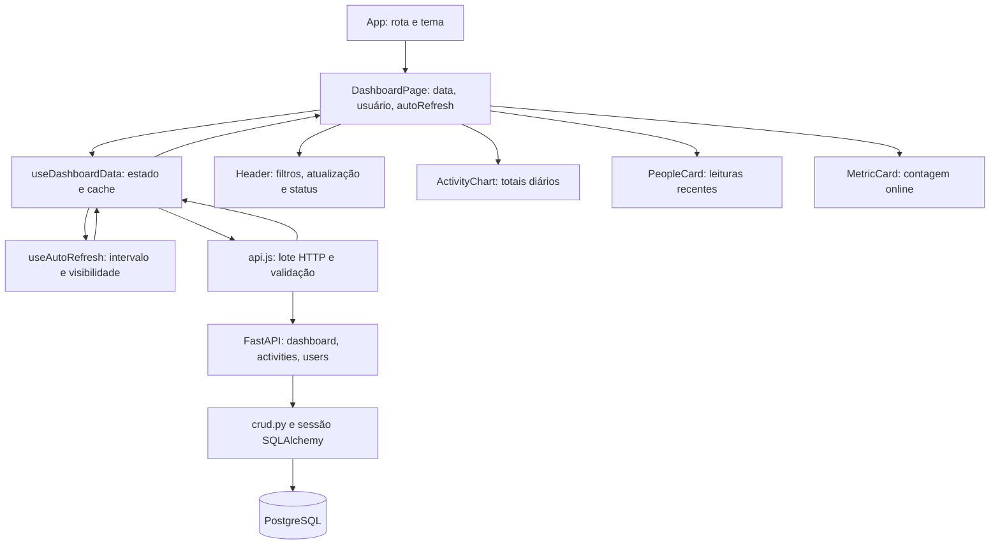

# Fluxo de dados e estados

Revisão: 23/09/2026. Caminhos de código abaixo são relativos a `FrontEnd/`.

## Primeira consulta e filtros

1. `DashboardPage` inicia a data no dia local (`safeIsoDate`), usuário vazio e
   atualização automática habilitada. Datas inválidas caem no dia local atual.
2. `useDashboardData` cria uma chave `data:usuário`, limpa dados de outro filtro
   e chama `fetchDashboardData` com um `AbortSignal`.
3. O serviço consulta sete resumos diários, realtime e usuários em paralelo:
   nove GETs na carga inicial. A série é calculada em UTC para evitar deslocar
   datas por fuso/DST; isso não define o fuso da agregação feita pelo banco.
4. O serviço valida os campos efetivamente consumidos e retorna `summary`,
   `realtime`, `users`, `weeklySummaries` e `availability`.
5. O hook registra dados e `updatedAt`. O painel filtra realtime por usuário
   localmente, conta `status === "online"` e entrega dados aos componentes.

Somente resumos recebem data/usuário na query. Realtime sempre representa a
janela recente do backend, mesmo quando uma data histórica está selecionada.
A lista de usuários permanece global; filtro visual não é autorização.

## Atualização e cancelamento

- Polling a cada 30 segundos enquanto a aba está visível. Retorno à aba atualiza
  imediatamente. Pausar o checkbox suspende futuras atualizações automáticas.
- Para o mesmo filtro, seis dias históricos bem-sucedidos são reutilizados:
  polling normal faz três GETs. Falhas históricas são tentadas novamente.
- Refresh manual limpa o cache e reconsulta todos os dias. Cache é memória do
  hook; sair do painel o descarta. Não há cache persistente nem TTL histórico.
- Mudar filtro, atualizar novamente ou desmontar aborta o lote anterior. O hook
  também verifica o signal antes de aceitar resultados, evitando respostas antigas.
- Cada request tem 15 segundos de timeout, incluindo `response.json()`. Falha
  do resumo obrigatório rejeita o lote e cancela requests pendentes. Falhas
  opcionais isoladas não cancelam os demais dados. Listeners e timers são limpos.

## Estados observáveis

| Situação | Dados / interface |
| --- | --- |
| Primeira carga ou novo filtro | `data: null`, loading; cards dizem que estão consultando |
| Sucesso com listas vazias | Ausência real de resultados, zero online quando realtime disponível |
| Falha opcional | `availability` false, status degraded, histórico marcado unavailable e tabela indisponível |
| Falha principal sem dados anteriores | Status offline, alerta/retry e cards indisponíveis |
| Refresh do mesmo filtro | Dados anteriores mantidos, `refreshing: true` |
| Falha de refresh | Dados anteriores mantidos; alerta identifica a última consulta concluída |
| Cancelamento | Sem alerta de erro nem aviso de indisponibilidade opcional |

`summary.users[].total_seconds` alimenta o gráfico em horas arredondadas a uma
casa decimal. O resumo não separa tempo ativo/inativo nem produtividade por task.
`PeopleCard` mostra usuário, processo, status e tempo desde a leitura; título de
janela, máquina e categoria não são renderizados. Demais indicadores/timeline
mantêm os placeholders existentes porque não têm contrato real.

## Outros estados

`App` inicializa `useTheme` em todas as rotas; a preferência salva em localStorage
é a única persistência do frontend. Login/cadastro e tasks mantêm campos apenas
em `useState`, sem envio HTTP. As rotas de autenticação ocultam Sidebar/layout,
mas não criam sessão. Hash inválido cai em `painel`; query no hash é ignorada.
